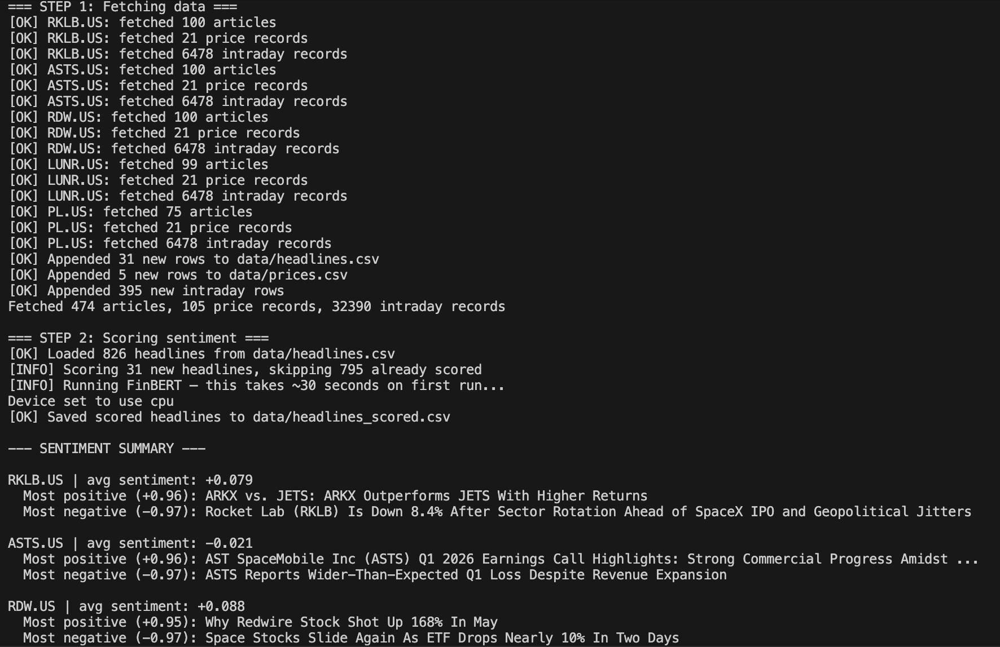
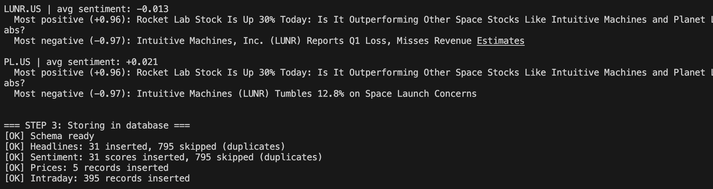

# Financial news sentiment pipeline
A Python pipeline that fetches financial data for selected space tech stocks and produces trading signals based on sentiment scored with FinBERT.

## What it does
- Fetches the latest headlines, price records, intraday data for 5 tickers via EODHD
- Scores each headline with FinBERT (incremental — only new headlines are scored on re-runs)
- Stores prices, headlines, sentiment scores, and a personal daily trade log in SQLite
- Builds a Streamlit dashboard with daily signals, rolling sentiment,
correlation of stock sentiment with volume z-score, headlines per ticker, and daily log.

## Signal logic
- `STRONG SIGNAL` — divergence > 0.15 and volume z-score > 2.0
- `WEAK SIGNAL - WAIT FOR VOLUME` — divergence > 0.15 but volume z-score ≤ 2.0
- `NEGATIVE SIGNAL` — divergence < -0.15 and volume z-score > 2.0
- `SECTOR DAY - STAND ASIDE` — more than 3 SpaceX mentions detected (sector-wide noise day)
- `NO SIGNAL` — all other cases

Divergence = company sentiment minus sector average for the day, excluding sector-wide articles.

## Tech stack
- Python 3.13.5
- EODHD · HuggingFace FinBERT
- SQLite · pandas
- python-dotenv

## Setup
1. Clone the repo  
2. Create a virtual environment: `python -m venv venv && source venv/bin/activate`  
3. Install dependencies: `pip install -r requirements.txt`  
4. Copy `.env.example` to `.env` and add your EODHD key  
5. Run: `python run_pipeline.py`
   > First run downloads the FinBERT model (~400MB) and may appear to hang for a minute — this is normal.

## Project Structure
fetch_news.py       — pulls headlines from EODHD
score_sentiment.py  — FinBERT scoring
database.py         — SQLite schema and queries
dashboard.py        — Streamlit dashboard
run_pipeline.py     — orchestrates the full pipeline
data/               — headlines.csv, prices.csv, intraday.csv, pipeline.db (SQLite)

## Architecture
```
run_pipeline.py
    │
    ├── 1. run_fetch()
    │       │
    │       └── fetch_news.py ──► EODHD API
    │               │
    │               ├──► data/headlines.csv
    │               ├──► data/prices.csv
    │               └──► data/intraday.csv
    │
    ├── 2. run_scoring()
    │       │
    │       └── score_sentiment.py (FinBERT)
    │               │  reads headlines.csv
    │               │  skips already-scored rows
    │               └──► data/headlines_scored.csv
    │
    └── 3. run_db_store()
            │
            └── database.py ──► data/pipeline.db (SQLite)
                                    ├── headlines
                                    ├── sentiment
                                    ├── prices
                                    ├── intraday
                                    └── daily_log

dashboard.py (Streamlit)
    └── queries pipeline.db → signals, charts, log
```

## Example Output


